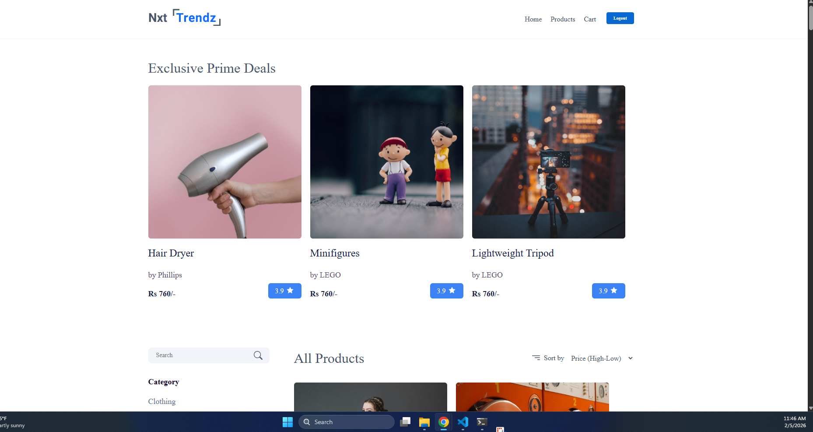
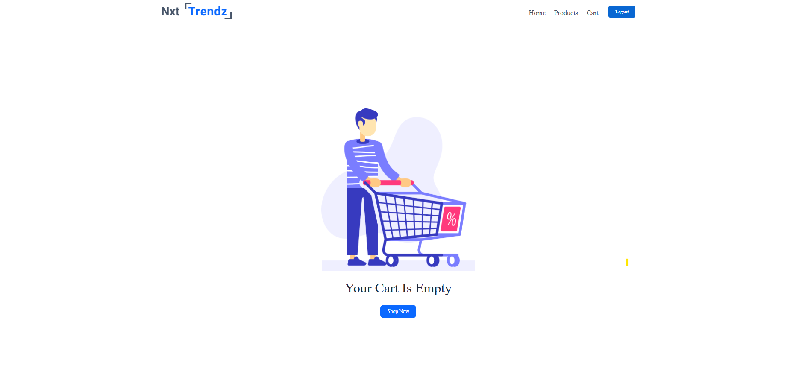

# E-Commerce Website (NxtTrendz Clone)

A React e-commerce website built with routing, protected routes, product listing, product details, and cart features (NxtWave API).

## Features

- JWT Login (NxtWave API)
- Protected routes (redirect to login if not authenticated)
- Products listing with API integration
- Product details page with similar products
- Cart: add item, increment/decrement quantity, remove item, remove all
- Cart summary (total amount)

## Tech Stack

- React
- React Router DOM (v6)
- Context API
- Vite
- CSS

## Demo Credentials (Provided by NxtWave API)

Username: rahul  
Password: rahul@2021

> Note: These are test credentials provided by the API for demo purposes.

## Getting Started (Run Locally)

```bash
npm install
npm run dev

## Screenshots

### Home


### Products


### Cart


```
